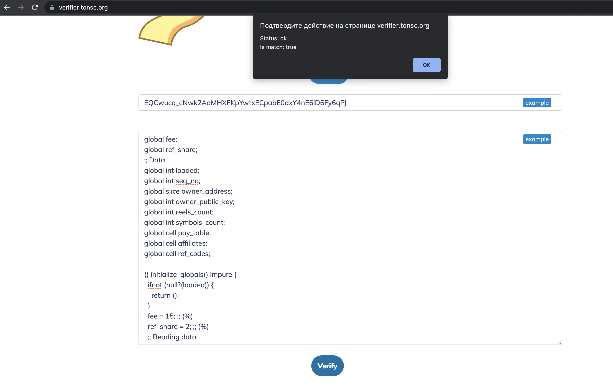

# ✅ Smart contract code verification

## Smart-Contract code Verifier

Recently [**TON Fruits**](https://t.me/ton\_fruits\_bot) **** had published [the source code](./) of their gambling smart contract. How can we ensure, that this particular code is running on the declared [address](https://ton.sh/address/EQCwucq\_cNwk2AaMHXFKpYwtxECpabE0dxY4nE6iD6Fy6qPJ) in the TON blockchain?

Developers from [tonsc.org](https://tonsc.org) made the service, that allows to validate, that particular address in TON blockchain contains smart contract with particular code. Let's check it out with TON Fruits example!&#x20;

To check it we need to get [**TON Fruits**](https://t.me/ton\_fruits\_bot) **** smart contract address **-** `EQCwucq_cNwk2AaMHXFKpYwtxECpabE0dxY4nE6iD6Fy6qPJ` and the [source code](./)

Lets open [https://verifier.tonsc.org/](https://verifier.tonsc.org) and paste address and code into the form, and press **Verify** button:

If pasted code is really running on that address, you will see success message like on the screenshot

Happy coding! 💎
