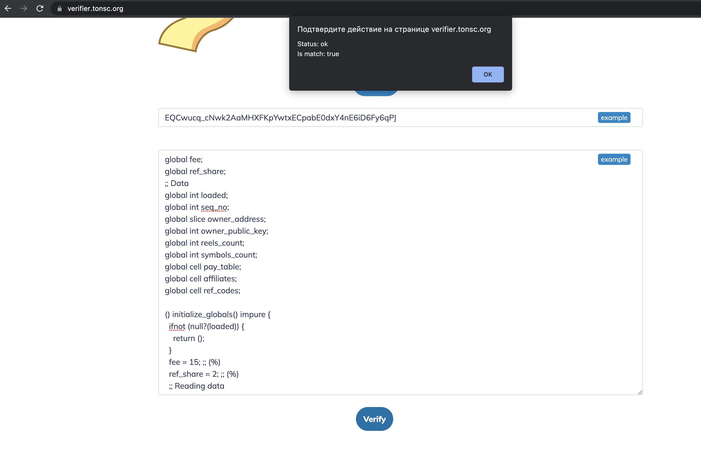

# ✅ Верификация кода смарт-контракта

## Smart-Contract code Verifier

Недавно проект [**TON Fruits**](https://t.me/ton\_fruits\_bot) **** опубликовал [исходный код](./) своего игрового смарт контракта. Как удостовериться, что на указанном [адресе](https://ton.sh/address/EQCwucq\_cNwk2AaMHXFKpYwtxECpabE0dxY4nE6iD6Fy6qPJ) в блокчейне TON  действительно выполняется заявленный код?

Существует сервис, разработанный [tonsc.org](https://tonsc.org), который позволяет верифицировать, что на определенном адресе в TON выполняется определенный код. Давайте проверим его в действии.

Для этого нам потребуется адрес смарт-контракта [**TON Fruits**](https://t.me/ton\_fruits\_bot) **-** `EQCwucq_cNwk2AaMHXFKpYwtxECpabE0dxY4nE6iD6Fy6qPJ`

Также нам потребуется [исходный код](./) контракта.

Далее нужно зайти на [https://verifier.tonsc.org/](https://verifier.tonsc.org) и вставить в форму адрес контракта и код, после чего нажать на кнопку **Verify**. Если вставленный вами исходный код действительно выполняется на этом адресе, вы увидите следующее сообщение:

